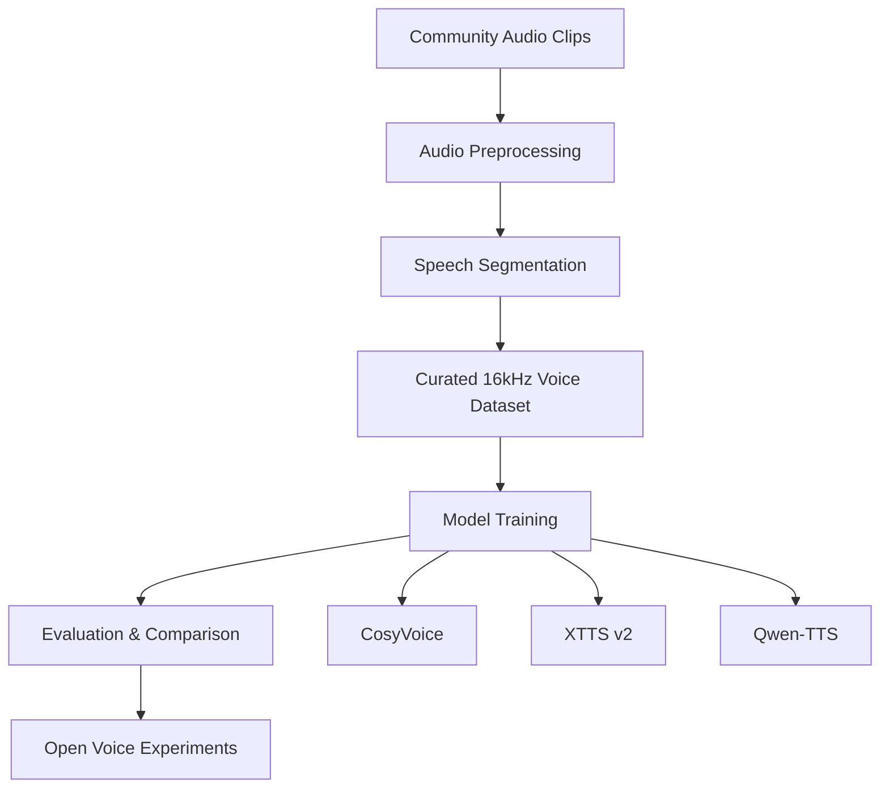

# 🎙️ Ani Voice Rebuild
<p align="center">
Recreating Ani's earlier voice characteristics using open-source neural TTS.
</p>


<p align="center">

⭐ **If you find this project interesting, please consider starring the repository to help others discover it.**

</p>

## 🔄 Voice Reconstruction Pipeline



Community effort exploring whether modern **open-source neural TTS models** can recreate earlier voice characteristics of **Ani**, the voice used in the Grok AI companion experience.

---

## 📤 Submit Audio Clips

Want to help build the dataset?

Upload clips to the shared submission folder:

👉 **[Upload Audio Clips](PASTE_YOUR_DRIVE_LINK_HERE)**

Accepted formats:

```
.wav
.mp3
.m4a
.mp4
```

Clips should ideally:

- contain one speaker
- have minimal background noise
- be between **3–15 seconds** long

Raw recordings are welcome — the preprocessing pipeline will segment them automatically.

See `SUBMISSIONS.md` for full guidelines.

# 🧠 Project Motivation

Many users noticed changes to Ani’s voice over time.  
For some, the original voice contributed significantly to the experience.

This project explores whether it is possible to approximate similar characteristics using:

- open speech datasets
- modern neural TTS architectures
- reproducible preprocessing pipelines

The goal is **open experimentation and community collaboration**, not replication of proprietary systems.

---

# 🔬 Project Goals

- Build a curated speech dataset
- Develop reproducible preprocessing pipelines
- Experiment with multiple open TTS models
- Evaluate voice consistency and realism
- Share results with the community

Ultimately the project aims to produce a **high-quality voice model that can run locally**.

---

## 📊 Dataset Progress

This project relies on community contributions to build a clean speech dataset for experimentation.

Current progress:

| Metric | Value |
|------|------|
| Clips collected | 0 |
| Total audio duration | 0 minutes |
| Target dataset size | 60+ minutes |

Why 60 minutes?

Modern neural TTS models can begin producing convincing voice characteristics with relatively small datasets. A curated dataset of **30–60 minutes of clean speech** can already enable meaningful experiments.

Even small contributions help. A few clips from many contributors can quickly add up to a useful dataset.

If you'd like to help, you can contribute by:

- submitting clean voice clips
- helping preprocess recordings
- validating dataset entries
- experimenting with model training

Dataset contributions will be tracked here as the project grows.

---

# ⚙️ Voice Rebuild Pipeline
**Community Audio Clips**  
⬇  
**Audio Preprocessing**  
normalize • trim silence • segment speech  

⬇  
**Curated Voice Dataset**  
16kHz mono WAV  

⬇  
**Model Training**  
CosyVoice • XTTS • Qwen-TTS  

⬇  
**Evaluation**  
naturalness • prosody • voice similarity  

⬇  
**Open Voice Experiments**

# 🤖 Models Being Evaluated

Initial experimentation will focus on modern open-source speech synthesis models:

| Model | Purpose |
|------|------|
| **CosyVoice** | High-quality expressive speech |
| **XTTS v2** | Multilingual neural voice cloning |
| **Qwen-TTS** | Transformer-based speech generation |

Future experiments may include:

- Bark-style models
- style conditioning techniques
- prosody fine-tuning

---

## 📁 Repository Structure

```text
ani-voice-rebuild/
│
├── README.md
├── CONTRIBUTING.md
├── SUBMISSIONS.md
├── LICENSE
├── requirements.txt
├── .gitignore
│
├── .github/
│   └── ISSUE_TEMPLATE/
│
├── docs/
│   └── dataset_format.md
│
├── tools/
│   ├── preprocess_audio.py
│   └── validate_dataset.py
│
└── dataset/
    ├── raw/
    │   └── drive_imports/
    ├── processed/
    │   └── wavs/
    └── metadata/
```

## 🚀 Quick Start

If you'd like to contribute audio clips or help experiment with the dataset, you can get started in just a few steps.

### 1️⃣ Clone the repository

```bash
git clone https://github.com/engineerx87/ani-voice-rebuild.git
cd ani-voice-rebuild
```

### 2️⃣ Install dependencies

Create a Python environment and install required packages:

```bash
pip install -r requirements.txt
```

You will also need **FFmpeg** installed for audio processing.

Linux:

```bash
sudo apt install ffmpeg
```

Mac:

```bash
brew install ffmpeg
```

Windows:

Download from:  
https://ffmpeg.org/download.html

---

### (Optional) Create a Python virtual environment

It is recommended to create a virtual environment before installing dependencies.

Linux / macOS:

```bash
python3 -m venv .venv
source .venv/bin/activate
```

Windows:

```powershell
python -m venv .venv
.venv\Scripts\activate
```

Then install the requirements:

```bash
pip install -r requirements.txt
```
---

### 3️⃣ Add raw audio clips

Community submissions are collected through the shared upload folder described in `SUBMISSIONS.md`.

Contributors **should upload clips to the shared submission folder**, not directly to this repository.

Maintainers periodically download those submissions and place them into:

```
dataset/raw/drive_imports/
```

Accepted formats include:

```
.wav
.mp3
.m4a
.mp4
```

The preprocessing script will automatically normalize and convert recordings into training clips.

---

### 4️⃣ Run the preprocessing pipeline

This will:

• normalize volume  
• remove silence  
• segment speech  
• convert to **16kHz mono WAV**

```bash
python tools/preprocess_audio.py
```

Processed clips will appear in:

```
dataset/processed/wavs/
```

---

### 5️⃣ Validate the dataset

You can check that clips meet the expected format:

```bash
python tools/validate_dataset.py
```

This verifies:

• sample rate  
• channel count  
• clip length  

---

### 6️⃣ Submit contributions

Once you have valid clips:

1. Commit your changes
2. Push to your fork
3. Open a Pull Request

Or open an issue if you'd like help with preprocessing or dataset formatting.

---

Even small contributions help — a few clean clips from several people can quickly build a useful dataset for experimentation.

# 🎧 Dataset Requirements

Processed training clips should meet the following targets:

| Property | Target |
|--------|--------|
| Format | WAV (16-bit PCM)  |
| Sample Rate | 16kHz |
| Channels | Mono |
| Ideal Clip Length | 3–15 seconds |
| Acceptable Range | 2–20 seconds |

Higher sample rates and stereo audio are acceptable for raw submissions.  
The preprocessing pipeline will normalize recordings to the required format.

Clips should contain **clear speech with minimal background noise**.

---

## 📦 Example Dataset Layout

```text
dataset/
├── processed/
│   └── wavs/
│       ├── ani_00001.wav
│       ├── ani_00002.wav
│       └── ani_00003.wav
└── metadata/
    └── metadata.csv
```

Example metadata entry:

```text
ani_00001|Hello, how are you today?
ani_00002|That sounds like a fun idea.
ani_00003|Let's try building it together.
```

## 🛠 Preprocessing Tools

The repository includes tools for converting messy recordings into training clips.

The preprocessing script automatically:

• normalizes audio volume  
• converts audio to **16kHz mono WAV**  
• trims silence  
• splits recordings into speech segments  

Example output:

```text
ani_00001.wav
ani_00002.wav
ani_00003.wav
```

# 🤝 Contributing

We welcome contributions in several areas.

### Audio Contributions

You can help by submitting **clean voice clips**.

Good clips typically have:

- one speaker
- minimal background noise
- no overlapping voices
- clear pronunciation
- length between **3–15 seconds**

---

### Dataset Processing

Help with:

- audio segmentation
- noise cleanup
- dataset validation

---

### Model Experimentation

Help experiment with:

- CosyVoice training
- XTTS fine-tuning
- Qwen-TTS experiments

---

### Evaluation

Help evaluate generated speech for:

- naturalness
- voice similarity
- prosody
- long-form consistency

---

# 🔐 Privacy & Respect

Please only contribute recordings you are comfortable sharing for open experimentation.

Avoid submitting:

- private conversations
- recordings containing multiple speakers
- personally identifying metadata

---

# 📊 Project Progress

| Milestone | Status |
|------|------|
| Repo initialization | ✅ |
| Dataset structure defined | ✅ |
| Preprocessing tools | ✅ |
| Community dataset collection | 🔄 |
| First training experiment | ⏳ |

---

# 🔮 Future Exploration

Areas of interest include:

- speaker conditioning
- expressive speech synthesis
- prosody modeling
- local inference optimization
- long-form voice stability

---

# 📜 License

Code in this repository is released under the **MIT License**.

Dataset licensing will depend on contributor permissions.

---

# ⭐ Support the Project

If you're interested in this project:

- ⭐ Star the repo
- 📢 Share the project
- 🎧 Contribute audio clips
- 🧠 Help with model experiments

Open voice research benefits from community collaboration.