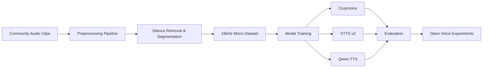

# 🎙️ Ani Voice Rebuild

## 🔄 Voice Reconstruction Pipeline

Community effort exploring whether modern **open-source neural TTS models** can recreate earlier voice characteristics of **Ani**, the voice used in the Grok AI companion experience.

---

# 🧠 Project Motivation

Many users noticed changes to Ani’s voice over time.  
For some, the original voice contributed significantly to the experience.

This project explores whether it is possible to approximate similar characteristics using:

- open speech datasets
- modern neural TTS architectures
- reproducible preprocessing pipelines

The goal is **open experimentation and community collaboration**, not replication of proprietary systems.

---

# 🔬 Project Goals

- Build a curated speech dataset
- Develop reproducible preprocessing pipelines
- Experiment with multiple open TTS models
- Evaluate voice consistency and realism
- Share results with the community

Ultimately the project aims to produce a **high-quality voice model that can run locally**.

---

# ⚙️ Voice Rebuild Pipeline
Community Audio Clips
│
▼
Audio Preprocessing
(normalize, trim silence,
segment speech)
│
▼
Curated Dataset
(16kHz mono WAV)
│
▼
Model Training
(CosyVoice / XTTS / Qwen-TTS)
│
▼
Evaluation
(naturalness, prosody,
voice similarity)
│
▼
Open Experiments & Results

---

# 🤖 Models Being Evaluated

Initial experimentation will focus on modern open-source speech synthesis models:

| Model | Purpose |
|------|------|
| **CosyVoice** | High-quality expressive speech |
| **XTTS v2** | Multilingual neural voice cloning |
| **Qwen-TTS** | Transformer-based speech generation |

Future experiments may include:

- Bark-style models
- style conditioning techniques
- prosody fine-tuning

---

# 📁 Repository Structure
ani-voice-rebuild/
│
├── README.md
├── CONTRIBUTING.md
├── LICENSE
│
├── docs/
│ └── dataset_format.md
│
├── tools/
│ ├── preprocess_audio.py
│ └── validate_dataset.py
│
└── dataset/
├── raw/
├── processed/
│ └── wavs/
└── metadata/

---

# 🎧 Dataset Requirements

Processed training clips should meet the following targets:

| Property | Target |
|--------|--------|
| Format | WAV |
| Sample Rate | 16kHz |
| Channels | Mono |
| Ideal Clip Length | 3–15 seconds |
| Acceptable Range | 2–20 seconds |

Clips should contain **clear speech with minimal background noise**.

---

# 📦 Example Dataset Layout
dataset/
processed/
wavs/
ani_00001.wav
ani_00002.wav
ani_00003.wav
metadata/
metadata.csv

Example metadata entry:
ani_00001|Hello, how are you today?
ani_00002|That sounds like a fun idea.
ani_00003|Let's try building it together.

---

# 🛠 Preprocessing Tools

The repository includes tools for converting messy recordings into training clips.

The preprocessing script automatically:

- normalizes volume
- converts audio to **16kHz mono**
- trims silence
- splits recordings into speech segments

Example output:
ani_00001.wav
ani_00002.wav
ani_00003.wav

---

# 🤝 Contributing

We welcome contributions in several areas.

### Audio Contributions

You can help by submitting **clean voice clips**.

Good clips typically have:

- one speaker
- minimal background noise
- no overlapping voices
- clear pronunciation
- length between **3–15 seconds**

---

### Dataset Processing

Help with:

- audio segmentation
- noise cleanup
- dataset validation

---

### Model Experimentation

Help experiment with:

- CosyVoice training
- XTTS fine-tuning
- Qwen-TTS experiments

---

### Evaluation

Help evaluate generated speech for:

- naturalness
- voice similarity
- prosody
- long-form consistency

---

# 🔐 Privacy & Respect

Please only contribute recordings you are comfortable sharing for open experimentation.

Avoid submitting:

- private conversations
- recordings containing multiple speakers
- personally identifying metadata

---

# 📊 Project Progress

| Milestone | Status |
|------|------|
| Repo initialization | ✅ |
| Dataset structure defined | ✅ |
| Preprocessing tools | ✅ |
| Community dataset collection | 🔄 |
| First training experiment | ⏳ |

---

# 🔮 Future Exploration

Areas of interest include:

- speaker conditioning
- expressive speech synthesis
- prosody modeling
- local inference optimization
- long-form voice stability

---

# 📜 License

Code in this repository is released under the **MIT License**.

Dataset licensing will depend on contributor permissions.

---

# ⭐ Support the Project

If you're interested in this project:

- ⭐ Star the repo
- 📢 Share the project
- 🎧 Contribute audio clips
- 🧠 Help with model experiments

Open voice research benefits from community collaboration.